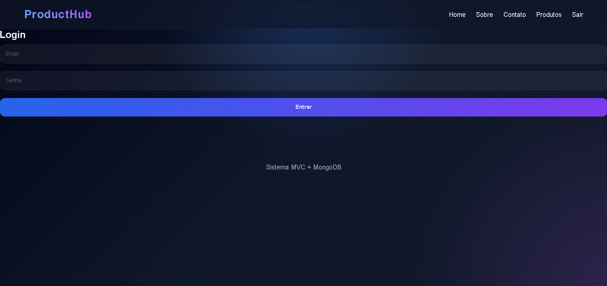
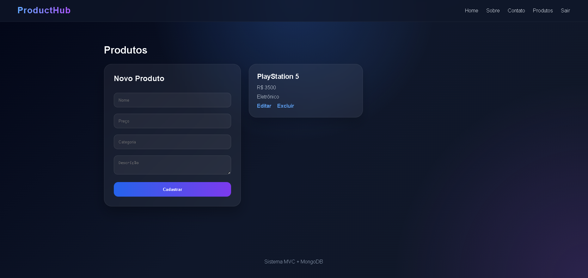

# Sistema MVC de Produtos com MongoDB


Aplicação web desenvolvida utilizando Node.js, Express, EJS e MongoDB Atlas seguindo o padrão MVC (Model-View-Controller).

O sistema possui autenticação de usuários, controle de sessão, proteção de rotas e um CRUD completo de produtos, utilizando persistência de dados no MongoDB Atlas e documentação interativa com Swagger/OpenAPI.

---

## Demonstração

### Tela de Login



A página de login permite que usuários autenticados acessem as funcionalidades protegidas do sistema através do controle de sessões.

---

### Gerenciamento de Produtos



Tela principal do sistema responsável pelo cadastro, listagem, edição e exclusão de produtos armazenados no MongoDB Atlas.

---

### Documentação Swagger


Interface interativa gerada pelo Swagger/OpenAPI para visualização e teste dos endpoints disponíveis na aplicação.

---

## Tecnologias Utilizadas

* Node.js
* Express
* MongoDB Atlas
* Mongoose
* EJS
* CSS
* Dotenv
* Express Session
* Cookie Parser
* Swagger UI Express
* Swagger JSDoc

---

## Estrutura do Projeto

```plaintext
src/
│
├── config/
│   └── db.js
│
├── controllers/
│   ├── produtoController.js
│   └── authController.js
│
├── middlawares/
│   └── auth.js
│
├── models/
│   └── Produto.js
│
├── routes/
│   ├── produtoRoutes.js
│   └── authRoutes.js
│
├── swagger/
│   └── swagger.js
│
├── views/
│   ├── home.ejs
│   ├── sobre.ejs
│   ├── contato.ejs
│   ├── login.ejs
│   ├── produtos.ejs
│   │
│   └── partials/
│       ├── header.ejs
│       └── footer.ejs
│
├── public/
│   └── css/
│       └── style.css
│
└── app.js
```

---

## Funcionalidades

* Página Home
* Página Sobre
* Página Contato
* Autenticação de usuários
* Controle de sessão
* Proteção de rotas
* Cadastro de produtos
* Listagem de produtos
* Edição de produtos
* Exclusão de produtos
* Armazenamento persistente utilizando MongoDB Atlas
* Documentação interativa utilizando Swagger/OpenAPI
* Interface responsiva

---

## Instalação

Clone o repositório:

```bash
git clone https://github.com/seu-usuario/seu-repositorio.git
```

Acesse a pasta do projeto:

```bash
cd seu-repositorio
```

Instale as dependências:

```bash
npm install
```

---

## Configuração do Ambiente

Este projeto utiliza variáveis de ambiente.

Crie um arquivo `.env` na raiz do projeto utilizando o modelo abaixo:

```env
PORT=3000
MONGO_URI=SUA_STRING_MONGODB_AQUI
SESSION_SECRET=sua_chave_secreta
```

Substitua `SUA_STRING_MONGODB_AQUI` pela sua string de conexão do MongoDB Atlas.

---

## Executando o Projeto

Rodar em modo de desenvolvimento:

```bash
npm run dev
```

ou

```bash
node src/app.js
```

Servidor:

```plaintext
http://localhost:3000
```

---

## Autenticação

O sistema utiliza autenticação baseada em sessões através do Express Session.

As rotas protegidas exigem autenticação prévia para acesso, garantindo maior segurança e controle sobre a navegação da aplicação.

---

## Rotas

### Home

```plaintext
GET /
```

### Sobre

```plaintext
GET /sobre
```

### Contato

```plaintext
GET /contato
```

### Login

```plaintext
GET /login
POST /login
```

### Logout

```plaintext
GET /logout
```

### Produtos

Listar:

```plaintext
GET /produtos
```

Cadastrar:

```plaintext
POST /produtos/adicionar
```

Editar:

```plaintext
GET /produtos/editar/:id
POST /produtos/editar/:id
```

Excluir:

```plaintext
GET /produtos/excluir/:id
```

---

## Documentação Swagger

A documentação interativa está disponível em:

```plaintext
http://localhost:3000/api-docs
```

Através dela é possível:

* Visualizar os endpoints disponíveis
* Consultar parâmetros de requisição
* Ver exemplos de entrada e saída
* Testar rotas diretamente pelo navegador
* Facilitar a integração com aplicações Front-end e Mobile

---

## Objetivo do Projeto

Projeto desenvolvido para fins acadêmicos com foco na prática de:

* Node.js
* Express
* MongoDB Atlas
* Mongoose
* Arquitetura MVC
* CRUD
* Sessões
* Swagger/OpenAPI
* Documentação de APIs
* Organização de projetos

---

## Autor

João Farias

Curso Técnico em Informática – CIMOL
